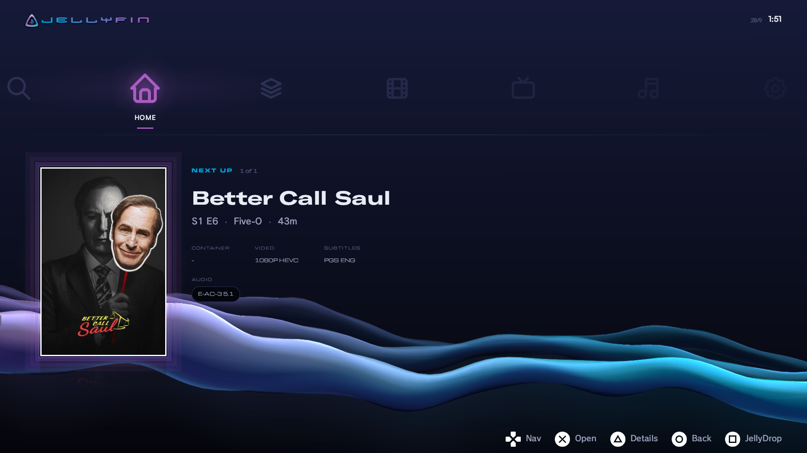
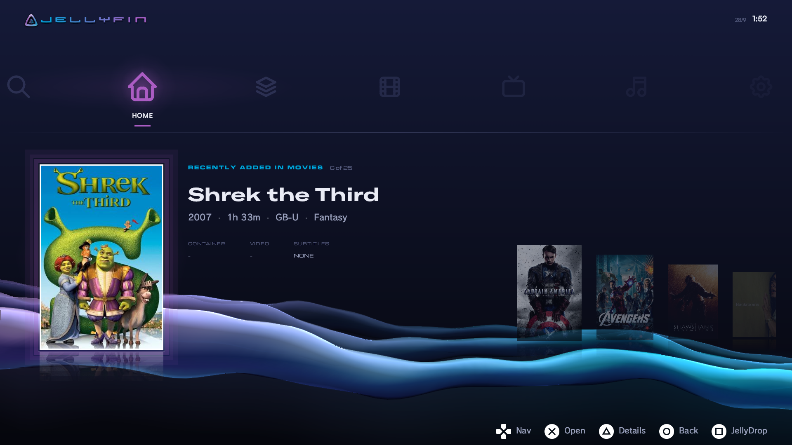
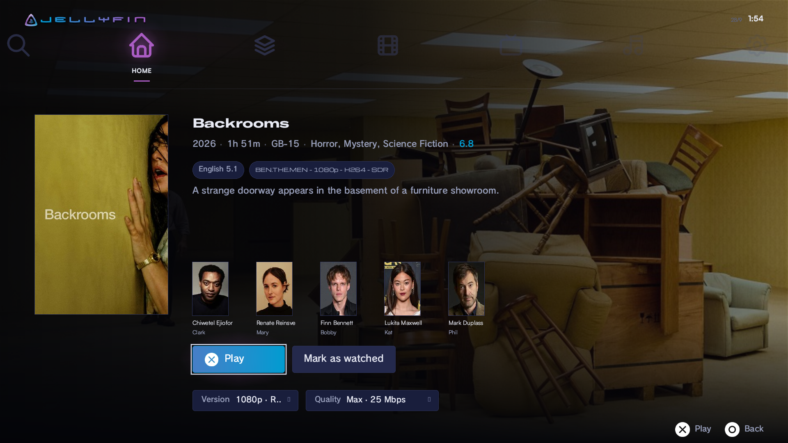
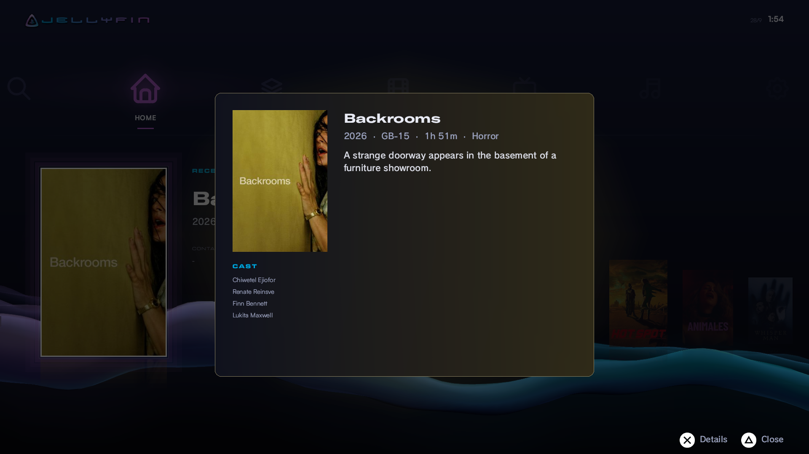
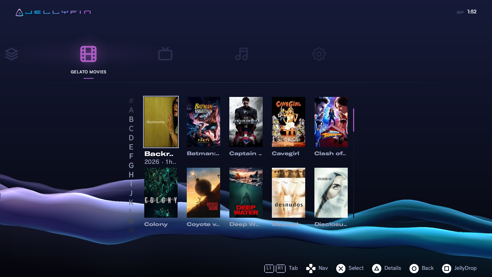
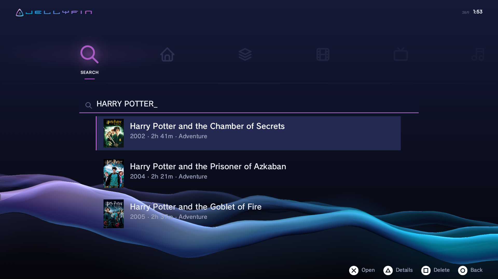
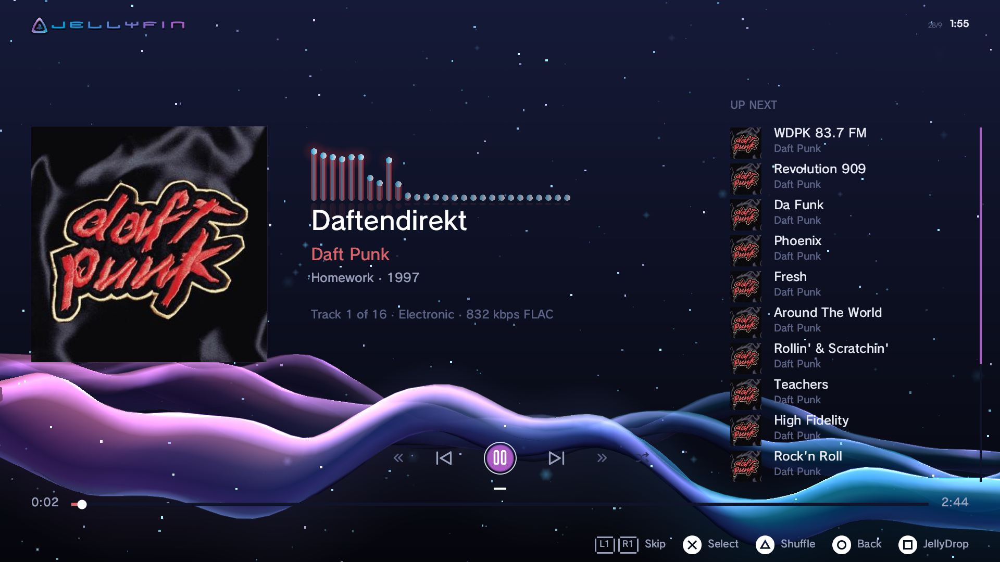
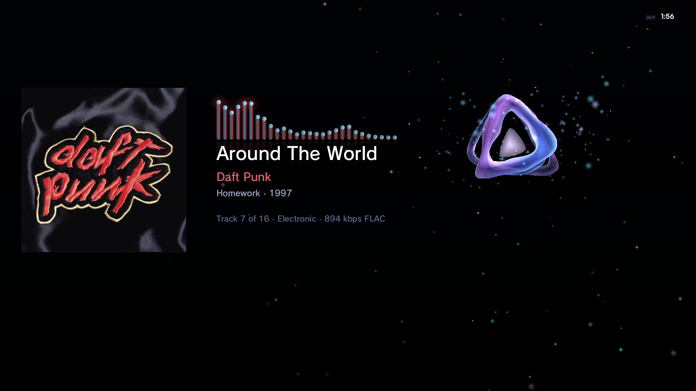
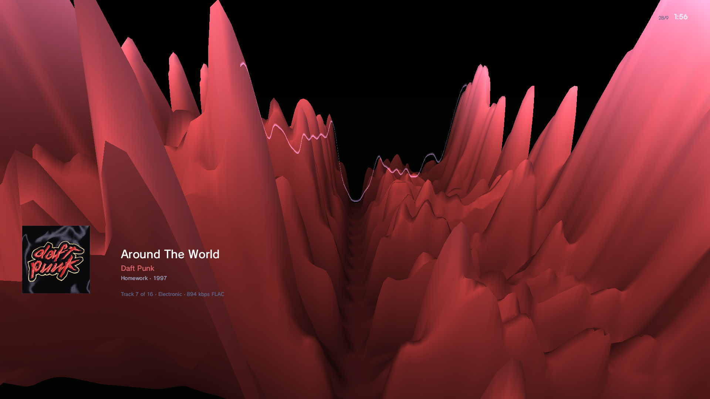

<div align="center">
  

  # JellyFin PS3

  **A native Jellyfin client for the PlayStation 3.**

  Play your whole Jellyfin library, movies, TV and music, straight from the couch.
  It's built to feel like it belongs on the console instead of a web page squeezed
  onto a TV.

  [](https://github.com/vortigauntlet/JellyFin-PS3-LosslessAudio/releases/latest)
  [](LICENSE)

  C/C++ · PSL1GHT · Evilnat CFW / HEN

</div>

---

> ### This is the Lossless Audio fork
>
> A fork of [MontyMcK/JellyFin-PS3](https://github.com/MontyMcK/JellyFin-PS3)
> that adds **lossless HD audio**, fixes 1080p playback, and (since 3.0) a whole
> new **XMB-style interface**: depth navigation, full details pages, the
> audio-reactive **JellyWave**, and **true 24 Hz output** for films.
>
> | | upstream | this fork |
> |---|---|---|
> | **TrueHD / Atmos** | not decoded | **lossless** 5.1 / 7.1 |
> | **DTS-HD MA** | not decoded | **lossless** (bit-exact vs ffmpeg) |
> | **DTS / DTS:X / DTS-ES** | not decoded | 5.1 core, up to 1509 kbps |
> | **AC-3 5.1** | — | yes, server-transcoded |
> | **1080p** | stalls on big files | stable to **25 Mbps** |
>
> ### [⬇ Download the latest release](https://github.com/vortigauntlet/JellyFin-PS3-LosslessAudio/releases/latest)
>
> One click, straight to the file. Copy it to a USB stick and install it from
> the XMB, or drop it in `/dev_hdd0/packages/` over FTP and use webMAN's
> Package Manager.
>
> **Then read [Recommended settings](#recommended-settings).** Two settings do
> almost all the work.

---

## Recommended settings

Defaults are safe but conservative. For a Blu-ray remux on a wired console:

| Setting | Where | Set it to |
|---|---|---|
| **1080p Playback** | Settings → 1080p Playback | **On** |
| **Quality** | `X` on a title → Quality (details page) | **Max** |
| **Audio Output** | Settings → Audio Output | **5.1** |
| **24Hz Output** | Settings → 24Hz Output | **Auto** (the default) |

**Audio Output** is Stereo / 5.1 / 7.1 / Dolby Digital, and 7.1 appears only
where the chain reports that it takes eight channels of LPCM — the app queries
the connected display rather than assuming. A surround mode asks the server to
stream-copy the source's own HD audio track and decodes it here; when a source
has no HD track it falls back to an AC-3 5.1 transcode automatically.
**Dolby Digital** is for a soundbar on an ARC link (see
[Surround sound](#surround-sound)): it sends Dolby Digital to the soundbar
instead of decoding here.

On 5.1 the app also applies a **routing fix**, because the cellAudio port is 8
channels wide while the HDMI output is 6, so the console folds 8→6 on the way
out — and on some receivers that fold loses the centre channel, taking the
dialogue with it. The app's own per-channel meter showed the centre leaving hot
(loudest of the three fronts in 59% of heartbeats, never silent) while nothing
reached the speaker, so the loss is downstream of us. Asking the console to
treat the output as 5.1 corrects it. **The wire stays uncompressed LPCM** —
verified with `audioOutGetState` — so lossless TrueHD and DTS-HD MA arrive
intact, and if a receiver ever does accept the request for real the app detects
that and reverts rather than let your audio be silently compressed. It is not a
setting, because there is nothing for a listener to decide; 7.1 skips it,
having no 8→6 fold to correct.

**Dialogue Boost** (Off / +3 / +6 / +10 dB) is a separate row and is about
level, not routing: none of these decoders applies dynamic range compression,
so full cinema range can leave dialogue well below effects on a compact system.

The Quality row runs 360p → 480p → 720p → **High** (10 Mbps) → **Very High**
(20) → **Max** (25), and prints the bitrate beside the name.

**Why Max stops at 25 Mbps.** The console can only *receive* about 25 Mbps
sustained. That is measured, not guessed, and it is the server that proves it:
the same Jellyfin endpoint hands a PC on the same LAN 537 Mbps. Back to back on
the same film, on an otherwise identical build:

| setting | throughput | frames on time | buffer ran empty |
|---|---|---|---|
| **25 Mbps** | 30.1 Mbps | **98%** | **never** |
| 30 Mbps | 25.0 Mbps | 30% | 68% of samples |

Note which way the throughput goes. Asking for 30 delivers *less* than asking
for 25, because the 30.1 is the buffer being topped up in bursts against a
demand of only 25 — it is fill rate with headroom, not a sustained rate. Ask
for 30 sustained and you get 25. A buffer bridges a spike; it cannot bridge a
permanent shortfall, so steps above 25 were removed rather than left in to
disappoint.

The quality you pick is remembered **per title**, so a heavy remux and a light
episode can each keep their own.

If playback stutters, drop to **Very High** before anything else.

---

## Screenshots

All taken on a real PS3 at 1920×1080. More in the
[v3.1 release notes](https://github.com/vortigauntlet/JellyFin-PS3-LosslessAudio/releases/tag/v3.1).

<table>
<tr><td width="50%" align="center"><br><sub>Home: one category at a time, over JellyWave</sub></td><td width="50%" align="center"><br><sub>Home: Left/Right slides the poster queue</sub></td></tr>
<tr><td width="50%" align="center"><br><sub>Details page: cast, versions, quality</sub></td><td width="50%" align="center"><br><sub>Triangle quick-peek</sub></td></tr>
<tr><td width="50%" align="center"><br><sub>Library grid with the A–Z jump bar</sub></td><td width="50%" align="center"><br><sub>Search results</sub></td></tr>
<tr><td width="50%" align="center"><br><sub>Music player with lossless FLAC and Up Next</sub></td><td width="50%" align="center"><br><sub>Music focus mode: audio-reactive JellyWave</sub></td></tr>
<tr><td width="50%" align="center"><br><sub>JellyDrop visualiser</sub></td><td width="50%" align="center"><br><sub>Canyon visualiser, the PS3's spectrogram rebuilt</sub></td></tr>
</table>

---

## What it does

**Interface**
- **An XMB-style interface.** Categories sit along a row like the PS3's own
  menu; press `Down` to step into one and `O` to step back out. Every category
  uses the same depth model, with a cold-boot animation, XMB menu sounds and
  left-stick navigation.
- **JellyWave**, a translucent take on the XMB wave, drawn on the GPU behind
  everything, with a day/night palette, particles, and a **Wave Intensity**
  setting.
- **Home** mirrors the Jellyfin web app: Continue Watching, Next Up and Recently
  Added, one category at a time.
- **Full details pages** (`X` on a title): play or resume, start over, version
  and quality pickers, cast, backdrop, and "Back to Season" for episodes.
  `△` anywhere flips a poster to show its synopsis (quick-peek).
- **Movies, TV, Collections and Music** as poster grids with an A-Z jump bar.
- **Search** with an on-screen keyboard; results open the details page or
  start playback directly.
- **Themes** (including your own `.ini`), menu particles, and overscan that
  scales the interface to fit your screen.

**More than the library**
- **Live TV and the guide**, from a Jellyfin server with a tuner or an IPTV
  playlist: a channel list with what's on now, a guide grid, channel up/down
  while watching.
- **Downloads**: a film, an episode or a whole season saved to the PS3's hard
  drive, played offline. They pause while you stream, resume after a restart,
  and always leave 10 GB free.
- **Favourites** on their own Home row.
- **A Media tab that plays from USB drives and the hard drive, with no server**:
  MKV, .m2ts and .ts files from **NTFS, exFAT or FAT32** drives (read only; the
  drive is never written to), with audio-track switching and a resume point
  kept on the console. H.264 only, with Dolby Digital, DTS, TrueHD or MP3 audio;
  the file's page says what a file lacks. Subtitles in these files and music files
  are not supported yet.

**Playback**
- **Hardware H.264 through the PS3's VDEC**, up to **1080p at 25 Mbps**.
- **True 24 Hz output.** 23.976 and 24 fps films switch the HDMI output to
  match, one frame per refresh, so there is no 3:2 pulldown judder. Each TV is
  checked once first. Settings → 24Hz Output.
- **Lossless HD audio**: TrueHD / Atmos and DTS-HD MA, decoded on the console
  (see [Surround sound](#surround-sound)).
- **Subtitles rendered by the console** (PGS and text) in 3 fonts and 3 colours,
  so turning them on no longer means a server-side burn-in.
- **Skip intro / recap / credits** from Jellyfin's media segments, with an
  **Auto Skip** setting. The next-episode countdown starts with the credits,
  and the next episode keeps your audio language, quality and version.
- **Resume and progress reporting**, so what you stop on the PS3 shows up as
  Continue Watching everywhere else.
- **A player bar** with play/pause, audio and subtitle menus, volume, and
  `L2`/`R2` seeking (tap to skip, hold to scrub). Slow seeks show a spinner,
  retry on failure, and `O` cancels them.

**Music**
- Albums, Artists, Playlists, Genres and Songs, a play queue with shuffle, and a
  Now Playing screen with lossless FLAC.
- **Audio-reactive visualisers**, cycled with `□`: **JellyWave** (lows, mids and
  highs each move their own layer), **JellyDrop** (the ribbons form the Jellyfin
  logo) and **Canyon** (the PS3's own spectrogram canyon, rebuilt). A focus mode
  dims everything but the art and the visualiser.

**Everything else**
- **Controllers:** DualShock 3, the **Blu-ray Disc remote**, USB and Bluetooth
  keyboards, and keyboard media keys.
- **Jellyfin 10.11 and 12** servers.
- **An update check at launch** that pops up quietly when a newer release is out,
  and a **Settings → Software Update** row that shows the result and checks again.
  See [`CHANGELOG.md`](CHANGELOG.md) for what changed in each release.

---

## Surround sound

Movies can play in **surround**: the app decodes the audio on the PS3 and
sends it out as multichannel LPCM. It is **off by default** — **Settings →
Audio Output** cycles through:

| Setting | What it does |
|---|---|
| **Stereo** | Stereo MP3 — the shipped path, untouched. The default. |
| **5.1** | Sends the source's own HD audio track untouched (no audio transcode) and decodes it here. **TrueHD / Dolby Atmos** plays **losslessly**. **DTS-HD MA** also plays **losslessly** — its XLL extension is decoded, verified bit-exact against ffmpeg on x86 *and* on the PPU's own big-endian PowerPC. **DTS, DTS-HD HRA, DTS-ES and DTS:X** play from their 5.1 core at up to 1509 kbps. Anything else, including Dolby Digital Plus, falls back to an AC-3 5.1 transcode — so this never plays worse than asking for AC-3 directly, which is why there is no separate AC-3 option. |
| **7.1** | The same, at eight channels. **Only offered when your receiver reports that it accepts 8-channel LPCM** — the app asks the connected display rather than guessing, so most soundbars correctly see only Stereo and 5.1. |
| **Dolby Digital** | Sends **Dolby Digital (AC-3)** to the soundbar or receiver untouched, and lets *it* decode. A film's own Dolby Digital track goes through as it is; any other track is converted to Dolby Digital by the server first. For a soundbar connected through the TV's **ARC** port, which takes only 2-channel PCM or Dolby Digital: LPCM 5.1 never reaches it there, and the centre channel (the dialogue) goes missing. Volume is then set on the soundbar. |

**No dialogue, or a silent centre speaker?** On 5.1 the app also corrects a
fault that silences dialogue on some receivers. The PS3's audio port is 8
channels wide and its HDMI output is 6, so the console folds 8→6 on the way
out — and that fold can lose the centre channel, which is where nearly all the
dialogue in a film mix lives. This is not a setting; there is nothing for a
listener to decide, and it is on whenever 5.1 is. **Nothing is compressed to
achieve it** — the audio on the wire stays uncompressed LPCM, verified by
reading the output's actual state rather than the value that was requested.

**Dialogue still too quiet?** **Settings → Dialogue Boost** (Off / +3 / +6 /
+10 dB). None of these decoders applies dynamic range compression, so a film
mix's full cinema range can leave dialogue well below effects on a compact
system. It is a level control, not a routing one.

For actual surround output you must also tell the PS3 your setup can take it:

> **XMB → Settings → Sound Settings → Audio Output Settings** — select your
> connector (HDMI/optical) and tick **Linear PCM 5.1 Ch. 44.1/48 kHz** (or your
> receiver's equivalent). Without this the PS3 silently mixes the 8-channel port
> down to stereo — the app cannot tell the difference, so check this first if
> everything plays but nothing comes out of the rears.

Notes and limitations:

- If the server cannot produce the fallback AC-3 5.1 transcode (old ffmpeg, or
  transcoding disabled), playback falls back to the shipped stereo MP3 path.
- Stereo-only sources still play in stereo (front speakers), as they should.
- There is **no bitstream passthrough** for homebrew on this platform, and that
  is now measured rather than assumed. PSL1GHT never bound `cellAudioOut`, so
  the request could not even be expressed; this app binds it directly and asks.
  The console reports **0 channels available** for TrueHD, DTS-HD MA and DD+,
  and when asked for AC-3 it accepts the request while leaving plain LPCM on
  the wire. Real passthrough appears to be tied to the Blu-ray player's
  privileged path. So everything is decoded on the PS3 and sent out as LPCM,
  and that sets what each format can be:
  - **TrueHD / Dolby Atmos: lossless.** The full 5.1 or 7.1 bed plays, bit for
    bit. Atmos *objects* are not rendered (no free renderer exists, and the
    app cannot know your speaker layout), so an Atmos track plays as its bed.
    See [docs/dolby-truehd.md](docs/dolby-truehd.md).
  - **DTS-HD MA: lossless.** The XLL extension is decoded, not just the
    backward-compatible core — verified bit-exact against ffmpeg on x86 and on
    the PPU's own big-endian PowerPC. **DTS:X** plays its 5.1 bed; the object
    data is not rendered, for the same reason as Atmos. **DTS-HD HRA and
    DTS-ES** play from their core, at up to 1509 kbps.
    See [docs/dts-hd.md](docs/dts-hd.md).
  - **Dolby Digital Plus (E-AC-3), including DD+ Atmos: unchanged.** Nothing
    here decodes it; the server transcodes it to AC-3 5.1 as before.
- HD mode streams the original audio track over your network instead of a
  640 kbps transcode — a TrueHD or DTS-HD MA track can be several Mbps on top
  of the video. That is fine on a LAN and a bad idea over the internet.
- 7.1 needs **Linear PCM 7.1 Ch.** ticked in the PS3's Sound Settings, the same
  way 5.1 does — and the app only offers 7.1 at all when the connected chain
  reports it will take eight channels.
- Music playback is stereo by design and ignores this switch.
- The **Player Stats Overlay** shows the negotiated result while playing:
  `truehd 8/8` is a lossless 7.1 bed, `truehd 6/8` a lossless 5.1 one,
  `ac3 6/8` is a working AC-3 5.1 transcode, `dts-hd 6/8` a DTS-HD/DTS:X track
  playing from its core, and `mp3 2/2` means the server fell back to stereo.

---

## Requirements

- A PS3 running **Evilnat CFW** or **HEN** (CEX)
- A **Jellyfin server** the console can reach (a local network is easiest)
- To build it yourself: the **ps3dev toolchain** (`ppu-gcc`, typically installed
  under `/usr/local/ps3dev/`) plus a **PSL1GHT** SDK checkout. Export `PSL1GHT`
  to point at the checkout and `PS3DEV` to your toolchain prefix — the `.pkg`
  target needs `sfo.xml` from `$PS3DEV/bin/sfo.xml`

---

## Install

**[⬇ JellyFin-PS3.pkg — latest release](https://github.com/vortigauntlet/JellyFin-PS3-LosslessAudio/releases/latest)**

Direct link to the current build: [`JellyFin-PS3.pkg`](release/JellyFin-PS3.pkg?raw=1), the same file as the release, kept in [`release/`](release/).

Then either:

- **USB:** copy the `.pkg` to the root of a USB stick, plug it into the console,
  and install it from the XMB (Game → Package Manager → Install Package Files), or
- **FTP:** drop it in `/dev_hdd0/packages/` and install it from webMAN MOD →
  Package Manager, no USB needed.

Installing over an existing copy is fine — your login and settings live outside
the app and are kept.

## Build from source

```bash
export PSL1GHT=/path/to/PSL1GHT
export PS3DEV=/usr/local/ps3dev

make clean && make      # SELF only
make pkg                # installable PKG
```

That gives you `<folder>.self` and `<folder>.pkg`, named after the checkout
directory. To install over an existing copy by FTP, use the NPDRM-signed
`obj/pkg/USRDIR/EBOOT.BIN` that `make pkg` leaves behind, not the `.self`.

> Cutting a release? Bump `APP_VERSION` in `source/net/update_check.h` to match the
> release tag so the update check compares against the right number.

---

## Controls

**Menus.** On the category row, `Left`/`Right` (or `L1`/`R1`) change category and
`Down` steps into it. Inside, the `D-pad` navigates, `X` opens the details page,
`△` quick-peeks, and `O` (or `Up` from the top) steps back out. `□` cycles the
visualiser. On the Blu-ray remote, `|<<` `>>|` and `<<` `>>` also switch tabs.

**Video player.** Press any button to bring up the player bar. `Left`/`Right`
move across it and `X` activates the focused control. `R2`/`L2` tap to skip, or
hold to scrub. `△` opens the audio and subtitle tracks, `□` puts the bar away,
and `O` or `Start` stops. When an intro or recap is playing, `X` skips it; during
the next-episode prompt, `Select` starts the next episode.

**Music player.** `Left`/`Right` move across the transport row, and going `Right`
past Shuffle drops you into the UP NEXT queue. `L1`/`R1` are previous/next track,
`R2`/`L2` seek, `△` toggles shuffle, `□` cycles the visualiser (hold for the next
Canyon preset), and `O` or `Start` stops.

**Search.** Type on the on-screen keyboard; `□` deletes and `O` clears. Press
`Down` to reach the results, then `X` to open one or `△` for its details.

**Settings.** The rows are in sections (Playback, Audio, Subtitles, Downloads,
Display, System). `L2`/`R2` jump between sections, `Left`/`Right` change a value
in either direction (`X` still steps forward), `△` explains the row, and `Up` from
the first row returns to the tabs.

**Live TV.** `X` watches the channel, `△` makes it a favourite, `Right` opens the
guide (`O` or `Left` at its first column comes back). While watching, `Up`/`Down`
change channel.

**Media.** `X` opens a drive or folder and then a file's page, where `X` plays or
resumes it; `O` goes up a folder, `L2`/`R2` page through a long one.

<details>
<summary>Full button reference</summary>

### Menus

| Button   | Action                                             |
|----------|----------------------------------------------------|
| Left / Right (category row) | Change category                     |
| Down (category row) | Step into the category                      |
| X        | Open the details page / confirm                    |
| O        | Back / step out to the category row                |
| D-pad    | Navigate                                           |
| L1 / R1  | Change category                                    |
| Remote `\|<<` `>>\|` / `<<` `>>` | Change category, for remotes without L1 / R1 |
| Triangle | Quick-peek (synopsis and cast)                     |
| Square   | Cycle the visualiser (JellyWave / JellyDrop / Off) |

### Video player

| Button          | Action                                                            |
|-----------------|-------------------------------------------------------------------|
| O / Start       | Stop / exit player (O closes an open track menu first)            |
| Square          | Hide the player bar before its timeout                            |
| Left / Right    | Move focus across the bar (Play/Pause · Audio · Volume · Subtitles) |
| X               | Activate the focused control; skip an intro or recap when offered |
| Triangle        | Audio and subtitle tracks                                         |
| R2 / L2 (tap)   | Skip +10 s / -10 s (taps within 1 s batch into one seek)          |
| R2 / L2 (hold)  | Pause and scrub the seek bar; seek fires once on release          |
| Select          | Jump to the next episode/movie (during the NEXT prompt, last 90 s)|

### Music player

| Button             | Action                                                        |
|--------------------|---------------------------------------------------------------|
| Left / Right       | Move focus across the transport row                           |
| Right past Shuffle | Enter the UP NEXT queue                                        |
| Up / Down (queue)  | Scroll the full remaining queue                               |
| X                  | Activate control / play the highlighted queue track           |
| Triangle           | Toggle shuffle                                                 |
| L1 / R1            | Previous / next track (previous restarts when >3 s in)        |
| R2 / L2            | Seek (tap batches, hold scrubs)                               |
| Square (tap)       | Cycle the visualiser: JellyWave / JellyDrop / Canyon / Off    |
| Square (hold)      | Next Canyon preset                                            |
| O / Start          | Stop playback and return to the library                       |

### Search

| Button    | Action                                  |
|-----------|-----------------------------------------|
| D-pad     | Move cursor on keyboard / in results    |
| X         | Type character / open result            |
| Square    | Delete a character                      |
| Triangle  | Details of the highlighted result       |
| O         | Clear the search (empty: next category) |
| Down      | Jump from keyboard to results           |
| Up        | Jump from first result back to keyboard |

</details>

---

## How it works

The architecture leans heavily on [Movian](https://github.com/andoma/showtime).
Its media player was the reference the whole app was built from.

**Video.** An HTTP MPEG-TS transcode stream gets demuxed on a decode thread. H.264
access units go to the PS3 VDEC (SPU-accelerated), decoded frames land in a 16-slot
jitter buffer, and a Movian-style 60 fps display loop blits them through the RSX. With **24Hz Output** on, a 23.976 or 24 fps film
switches the display to that rate and shows one frame per refresh. Otherwise a
crossfade shader blends between decoded 24 fps frames on a Bresenham
accumulator locked to hardware vsync, to soften the 2:3 pulldown judder.

**Audio.** Stereo MP3 is decoded with minimp3; in a surround mode the source's
own TrueHD, DTS-HD MA, DTS or AC-3 track is decoded on the PPU instead (see
[Surround sound](#surround-sound)). Either way the PCM goes into a ring and pushed to the PS3 audio
DMA at 48 kHz. The audio PTS drives the master clock, and an EMA keeps AV sync inside
±5 ms.

**Seeking.** Jellyfin's transcode isn't byte-seekable, so seeks copy Movian's
flush-and-reopen path: stop the decode thread, flush the decoder, audio and jitter
buffer, re-request the stream at the new `StartTimeTicks`, then resume. The audio
clock re-seeds from the new segment, so the seek bar snaps to the right spot on its
own.

**Music.** The music player reuses the same audio port through a pluggable PCM
source that pulls Jellyfin's audio transcode endpoint. The spectrum visualizer taps
samples at the DMA read cursor rather than at decode time, so the bars match what's
coming out of the speakers instead of what's buffered a fraction of a second ahead.

<details>
<summary>Deeper technical notes (pipelines, HUD, threading, file layout)</summary>

### Video pipeline

```
HTTP stream (MPEG-TS)
        |
        v
  Decode thread: stream_read() -> 188-byte TS packets -> video_feed_ts()
  TS demuxer -> PAT/PMT -> PES reassembly
        |
        +- Audio PES -> adec_push_pes() -> minimp3 -> PCM ring
        |
        +- Video PES -> vdecDecodeAu() -> VDEC (SPU H.264)
                |
                v
         VDEC callback: vdec_pull_frame() -> YUV -> ARGB
                |
                v
         Jitter buffer (16 slots, ~28 MB at 720p, PTS + duration per slot)
                |
                v
         Upload thread -> RSX-local texture (double-buffered, A + B for blend)
                |
                v
         Display loop (60fps): Bresenham gate + gcmSetVBlankHandler @ 59.94 Hz
                |
                v
         RSX blit: crossfade shader blends A -> B mid-pulldown, flip()
```

- **FPS detection:** VDEC `frame_rate_code` maps to exact fractional fps
  (ISO 13818-2); refresh rate comes from `videoGetState` (59.94 Hz).
- **Temporal blending:** each frame carries a remaining duration. When it drops
  below one vblank and the next frame is ready, the shader crossfades on the
  fractional remainder, so there's no fixed pulldown pattern to fight.
- **AV sync:** `avsync_compute_diff()` takes video PTS minus audio PTS and smooths
  it with an EMA; each vblank period gets nudged ±5000 µs to correct drift. It's
  locked once that stays below ~41.6 ms.

### Seek pipeline

Modelled on Movian's `mp_flush` reposition path:

```
Compute target = audio_clock + delta -> Jellyfin 100-ns ticks (StartTimeTicks)
Stop decode thread (audio + upload keep running, idle on empty buffers)
Flush: vdec_flush() · adec_flush() · jbuf_clear() · video_reset_demux() · avsync_reset()
Re-request stream at new StartTimeTicks -> re-prefill jitter buffer
Respawn decode thread -> resume (audio clock re-seeds from new segment)
```

`SEEK_REOPEN_VDEC` swaps the decoder reset for a full close/open rebuild. It's
slower but bulletproof, handy for A/B testing on hardware.

### HUD overlay

The in-player HUD gets composed by the CPU into a staging buffer **only when its
content changes**, uploaded to an RSX texture, and then drawn each frame as one
alpha-blended quad over the video. That way a visible seek bar costs the display
loop almost nothing. Getting there took a few tries: a vertex-array quad that froze
the console on pause, a CPU framebuffer blend that tanked to ~5 fps, and a per-frame
CPU draw that halved the frame rate. The earlier dim-strip paths are still kept
behind compile defines for hardware testing:

| Define            | Path                                                  |
|-------------------|-------------------------------------------------------|
| (none, default)   | Inline GPU quad, fast and freeze-proof                |
| HUD_DIM_CPU       | CPU pixel blend, slow but bulletproof fallback        |
| HUD_DIM_GPU_ARRAY | Original array-fetch quad, known to freeze, test only |

While paused with no input, the display loop stops redrawing altogether. The frame
is pixel-identical anyway, so it just polls input at vblank rate until something
changes.

### Audio & burned-in subtitles

Subtitles are normally rendered on the console (PGS and text). Only when a track
cannot be fetched does the app fall back to asking the server to burn it in, and
that flips the server to `SubtitleMethod=Encode`, which
front-loads several seconds of audio while the subtitle-burning encoder warms up. A
256-slot PES queue holds that burst compressed and the decoder back-pressures on the
PCM highwater, so nothing gets dropped and playback stays in sync. It used to skip
about 10 seconds ahead on real hardware before this fix.

### Version / MediaSource selection

Press `X` on a playable title to open its details page. When Jellyfin exposes
more than one source, the page shows a **Version** picker next to **Quality**;
focus it and press `X` for a scrollable list (up to 32 entries). The chosen `MediaSourceId` is negotiated when Play is pressed, along
with that source's own audio/subtitle tracks. The version list is not retained
by the player and cannot be switched mid-stream. This covers normal Jellyfin
multi-version movies and plugin-provided alternatives such as Gelato/AIOStreams.

### Threading model

| Thread         | Priority | Role                                                     |
|----------------|----------|----------------------------------------------------------|
| Display (main) | default  | Bresenham gate, RSX blit, flip, input poll, seek control |
| Decode         | 800      | TS demux, VDEC submit, jitter buffer fill                |
| Upload         | 850      | memcpy jitter buffer to RSX texture (A + B)              |
| Audio          | 750      | DMA event loop, PCM ring drain                           |
| Progress       | 1100     | POST position to Jellyfin every ~10 s                    |
| Async log      | 1200     | Ring-buffer drain to `player_log.txt` (when enabled)     |

On a seek, only the decode thread gets stopped and respawned.

### Source layout

```
source/
|-- api/      Jellyfin REST surface (auth, browse, detail, playstate)
|-- audio/    Audio port + DMA ring, minimp3 decode
|-- cache/    Thumbnail caching
|-- gfx/      RSX helpers, shaders, embedded fonts, stb_image/truetype
|-- music/    Audio-only engine, FFT visualizer, Now Playing screen
|-- local/    Drives and files with no server: one read-only file layer over the
|             hard drive and USB (FAT32, NTFS, exFAT), file probing, names, resume points
|-- net/      HTTP client, GitHub update check
|-- offline/  Downloads: queue, store, library, free-space rules
|-- player/   Core loop, HUD, GPU draw, decode/upload/audio threads, TS stream
|-- ui/       XMB UI: input, OSK, home shelf, browse, search, settings, rendering
|-- util/     Frame pacing / AV sync, async logging
`-- video/    Session glue, TS demux, VDEC, jitter buffer
```

</details>

---

## Logging

Debug logging is **on by default** and you toggle it from the Settings tab
(**Debug Logging**). That choice sticks across restarts in
`/dev_hdd0/tmp/jellyfin_settings.txt`. When it's on, output goes to
`/dev_hdd0/tmp/player_log.txt`, and **Settings → System → Send Log to Server**
uploads it to your Jellyfin server (Dashboard → Logs) so you can attach it to a
bug report without FTP. A crash log always gets written
synchronously to `/dev_hdd0/tmp/crash_log.txt`, and the launch update check leaves
its own trace in `/dev_hdd0/tmp/update_detection.txt`.

---

## Acknowledgments

- **[Movian](https://github.com/andoma/showtime)** (formerly Showtime). The whole
  app was built using Movian's media player as a reference. The video display loop,
  the temporal frame blending, and the flush-and-reopen seek path all follow how
  Movian does it. Big thanks to Andreas Öman and everyone who's worked on it.
- **[ps3dev](https://github.com/ps3dev)** for keeping
  **[PSL1GHT](https://github.com/ps3dev/PSL1GHT)** alive: the SDK, toolchain, and
  libraries that make open PS3 homebrew possible in the first place. PSL1GHT is
  MIT-licensed, Copyright (c) 2011 PSL1GHT Development Team.
- **[mohasi/ps3-dev](https://github.com/mohasi/ps3-dev)**, whose hand-written NTFS and
  exFAT readers (Apache-2.0) are vendored, read-only, in
  [`third_party/mohasi_fs`](third_party/mohasi_fs) so the app can play files from
  USB drives. What was changed is listed in that directory's README.
- The authors of the embedded libraries (minimp3, stb_image, stb_truetype), and the
  Jellyfin project itself.

---

## License

JellyFin PS3 is free software licensed under the **GNU General Public License v3.0**
(or, at your option, any later version). The full text lives in the
[LICENSE](LICENSE) file.

Copyright (C) 2026 Montague McKeefry

This program is distributed in the hope that it will be useful, but WITHOUT ANY
WARRANTY; without even the implied warranty of MERCHANTABILITY or FITNESS FOR A
PARTICULAR PURPOSE. See the GNU General Public License for more details.

Bundled third-party components keep their own licenses. The main one is the PSL1GHT
SDK (MIT), which is GPLv3-compatible.
